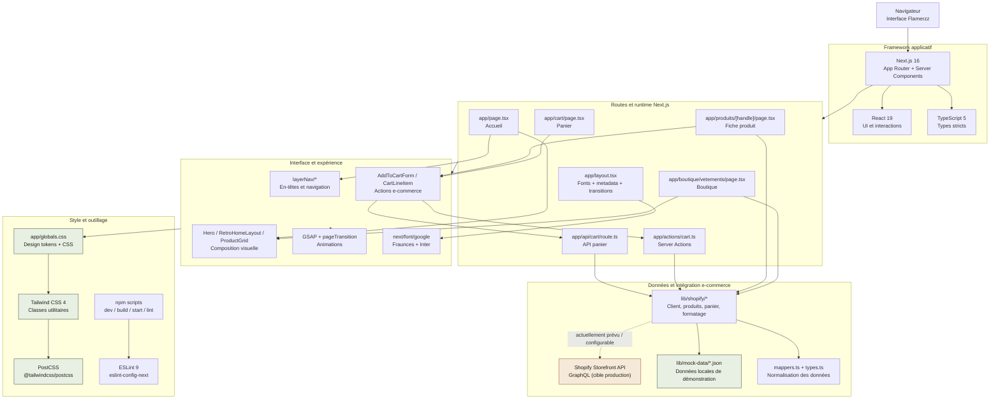

# Stack du projet

## Vue d'ensemble

## Technologies

- **Runtime et framework :** Node.js/npm, Next.js 16, React 19, TypeScript 5.
- **UI :** App Router, composants React, `next/font/google`, Fraunces et Inter.
- **Styles :** Tailwind CSS 4, PostCSS et `app/globals.css`.
- **Animations :** GSAP et transition de page maison.
- **Commerce :** abstraction `lib/shopify/`, requêtes GraphQL Storefront API prévues, données JSON locales pour le développement.
- **Qualité :** ESLint 9 avec `eslint-config-next`, vérification TypeScript via la configuration Next.